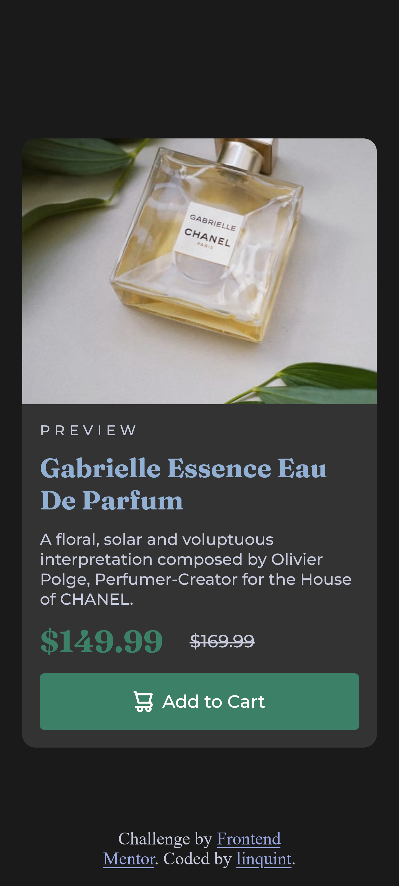

# Frontend Mentor - Product preview card component solution

This is a solution to the [Product preview card component challenge on Frontend Mentor](https://www.frontendmentor.io/challenges/product-preview-card-component-GO7UmttRfa). Frontend Mentor challenges help you improve your coding skills by building realistic projects. 

## Table of contents

- [Overview](#overview)
  - [The challenge](#the-challenge)
  - [Screenshot](#screenshot)
  - [Links](#links)
- [My process](#my-process)
  - [Built with](#built-with)
  - [What I learned](#what-i-learned)
- [Author](#author)
- [Acknowledgments](#acknowledgments)

## Overview

### The challenge

Users should be able to:

- View the optimal layout depending on their device's screen size
- See hover and focus states for interactive elements

### Screenshot

### Links

- Solution URL: [Add solution URL here](https://your-solution-url.com)
- Live Site URL: [Add live site URL here](https://your-live-site-url.com)

## My process

### Built with

- Semantic HTML5 markup
- CSS custom properties
- Flexbox
- Desktop-first workflow

### What I learned

That was the first challenge that I did on Frontend mentor. I chose an easy 
challenge because, to me, the main point of doing it was not to learn a lot 
of new things. Instead, it was to see how well I would manage to do it on my 
own, without the help of Google or other sources.

## Author

- Website - [linquint](https://www.linquint.dev)
- Frontend Mentor - [@linquint](https://www.frontendmentor.io/profile/linquint)
- Twitter - [@agurkijus](https://www.twitter.com/agurkijus)
- Github - [@linquint](https://www.github.com/linquint)

## Acknowledgments

YouTube channel from which I found out about Frontend Mentor:
[Web Dev Cody](https://www.youtube.com/@WebDevCody)
